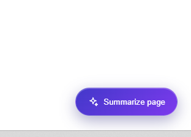
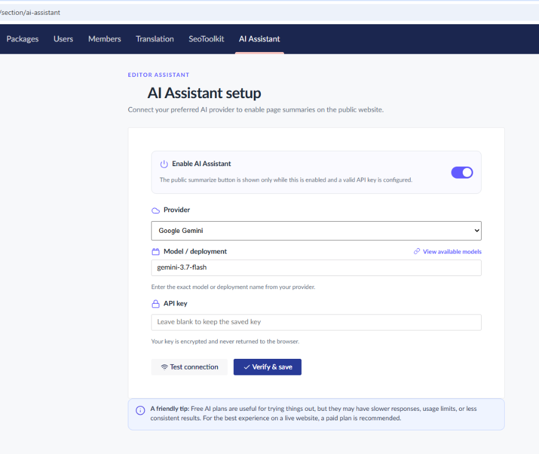
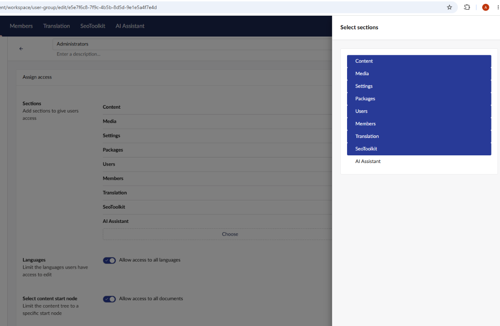

# Editor Assistant AI for Umbraco

Editor Assistant AI adds an AI-powered page summarizer to an Umbraco website. Editors configure the provider from the Umbraco backoffice, while website visitors can use a floating **Summarize page** button to get a concise summary of the current page.

## What it does

- Adds an **AI Assistant** section to the Umbraco backoffice.
- Provides a setup page for selecting a provider, model or deployment, endpoint, and API key.
- Supports Microsoft Azure OpenAI, OpenAI, Anthropic Claude, Google Gemini, DeepSeek, and local Ollama.
- Tests the provider connection before saving enabled settings.
- Caches identical chat responses for five minutes to reduce repeated provider requests.
- Stores provider settings using ASP.NET Core Data Protection encryption.
- Injects the frontend assistant automatically; no layout changes or script tag are required.
- Shows the assistant only on public frontend pages, never inside `/umbraco`.
- Renders summaries in a friendly floating dialog with readable point-by-point cards.

## Requirements

- Umbraco CMS 17.6 or later.
- .NET 10 SDK and runtime.
- For frontend development: Node.js 20.17 or later.
- Either a cloud AI provider account with an API key and model/deployment, or a local Ollama installation with a downloaded model.
- Cloud providers require an API key and may incur usage charges. Ollama runs locally, does not require an API key, and does not send page content to a cloud provider.

## Installation

Install the NuGet package in the Umbraco web project:

```bash
dotnet add package EditorAssistant.AI.Umbraco
```

Alternatively, add the package reference to the web project's `.csproj`:

```xml
<PackageReference Include="EditorAssistant.AI.Umbraco" Version="x.y.z" />
```

Restore and start the Umbraco website:

```bash
dotnet restore
dotnet run
```

The package registers its Umbraco API and frontend startup integration automatically.

On public frontend pages, visitors can use the floating **Summarize page** button:



## Configure the assistant

### Find the setup page

1. Sign in to the Umbraco backoffice at `/umbraco`.
2. Open the **AI Assistant** section in the left-hand backoffice navigation.
3. Open the **Setup** view.
4. Select a provider, enter its connection details, select **Test connection**, and then select **Verify & save**.
5. Enable the assistant when you want the floating **Summarize page** button to appear on public frontend pages.

The setup page looks like this:



The assistant button is not displayed inside `/umbraco`. It is injected only into public frontend pages after the feature is enabled and the provider has been configured successfully.

Identical page-summary requests are cached in memory for five minutes. The cache is local to the Umbraco application instance and connection tests always call the provider directly.

### Backoffice permissions

The AI Assistant section is permission-protected. A user must belong to a user group that has access to the section:

1. Sign in as an administrator or another user with permission to manage users.
2. Open **Users** in the Umbraco backoffice.
3. Open **User groups**.
4. Select the user group for the editor.
5. Grant access to the **AI Assistant** section.
6. Save the user group, sign out and back in (or reload the backoffice), and check the left-hand navigation again.

When selecting sections for a user group, choose **AI Assistant** as shown below:



If the tab is still missing, confirm that the logged-in user belongs to the edited user group and perform a hard refresh to clear cached backoffice assets.

### Provider requirements

The setup page supports six providers. The provider name, model name, endpoint, and API key must match the selected provider.

| Provider | What you need | Endpoint | API key |
| --- | --- | --- | --- |
| Microsoft Azure OpenAI | An Azure OpenAI resource and a deployed model | Your Azure OpenAI resource endpoint, for example `https://your-resource.openai.azure.com` | An Azure OpenAI key |
| OpenAI | An OpenAI project/API key and an available model | Not required | An OpenAI API key with available quota |
| Anthropic Claude | An Anthropic API key and an available Claude model | Not required | An Anthropic API key |
| Google Gemini | A Google AI Studio/Gemini API key and an available Gemini model | Not required | A Gemini API key with access to the selected model |
| DeepSeek | A DeepSeek API key and an available DeepSeek model | Not required | A DeepSeek API key with available quota |
| Ollama | Ollama installed on the Umbraco server and a downloaded local model | Normally `http://localhost:11434` | Not required |

### Model and deployment values

Enter the exact value expected by the provider:

- **Azure OpenAI:** enter the deployment name you created in Azure, not just the underlying model family.
- **OpenAI:** enter an available model such as `gpt-4o-mini`.
- **Claude:** enter the exact Claude model identifier available to your Anthropic account.
- **Gemini:** enter the exact Gemini model identifier supported by the Gemini `generateContent` API, such as `gemini-flash-latest`.
- **DeepSeek:** enter the exact model identifier available to your account, such as `deepseek-chat`.
- **Ollama:** enter the local model name, such as `llama3.2`.

Use the model documentation link beside **Model / deployment** in the setup page to check the current provider model names. Provider model availability can change over time.

### Provider-specific setup

#### Microsoft Azure OpenAI

Create an Azure OpenAI resource, deploy a model, and copy:

- The resource endpoint into **Azure OpenAI endpoint**.
- The deployment name into **Model / deployment**.
- One of the resource API keys into **API key**.

#### Google Gemini

Create a Gemini API key in Google AI Studio, ensure the selected model is available to the key, and enter the key and model in the setup page. The package sends Gemini requests using the native `generateContent` API.

#### Ollama

Install Ollama on the same machine that runs Umbraco, start the service, and download a model:

```bash
ollama serve
ollama pull llama3.2
```

Use `llama3.2` as the model and `http://localhost:11434` as the endpoint. Ollama is local and does not require an API key.

## Provider notes

### Google Gemini

Use the model name accepted by the Gemini `generateContent` API, for example `gemini-flash-latest`. The package uses Gemini's native API request format and reports provider error messages in the setup page.

### Ollama

Run Ollama locally and pull a model before testing:

```bash
ollama serve
ollama pull llama3.2
```

Use `llama3.2` as the model and `http://localhost:11434` as the endpoint. No API key is required.

## Security and privacy

- Cloud provider API keys are encrypted with ASP.NET Core Data Protection.
- API keys are never returned to the browser by the settings endpoint.
- The public summarize endpoint sends the page text to the configured provider when a visitor requests a summary.
- Do not enable the assistant unless the configured provider and data handling meet your site's privacy requirements.

## Building from source

Build the .NET solution:

```bash
dotnet build EditorAssistant.AI.Umbraco.slnx
dotnet test EditorAssistant.AI.Umbraco.slnx
```

Build the client bundle:

```bash
cd src/EditorAssistant.AI.Umbraco/Client
npm install
npm run build
```

The client build is copied into `src/EditorAssistant.AI.Umbraco/wwwroot/App_Plugins/EditorAssistantAIUmbraco`.

## Project structure

```text
src/
  EditorAssistant.AI.Umbraco/       Package source and backoffice client
tests/
  EditorAssistant.AI.Umbraco.Tests/ Unit tests
docs/
  images/                           Documentation images
```

## Troubleshooting

- **AI Assistant is not visible:** grant the user group access to the section and reload the backoffice.
- **The button is not visible:** confirm the assistant is enabled and the provider connection has been verified. For cloud providers, an API key must be configured.
- **Model unavailable:** check the provider's current model list and enter the exact model or deployment name.
- **Ollama cannot connect:** confirm `ollama serve` is running, the endpoint is reachable from the Umbraco server, and the model has been pulled.
- **Stale frontend assets:** rebuild the client and hard-refresh the browser.

## License

See the repository license and package metadata for licensing information.
