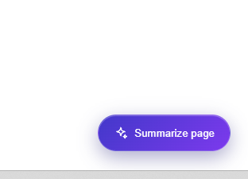
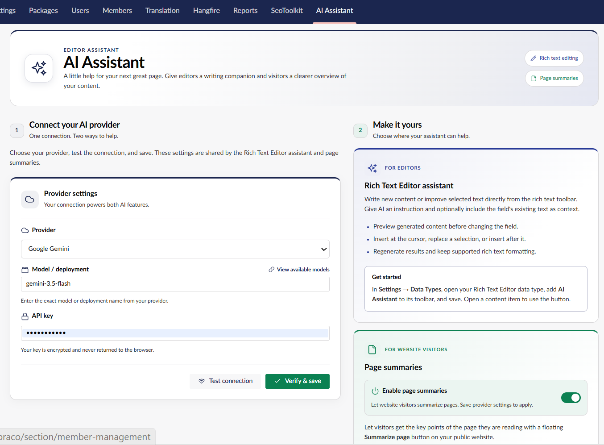
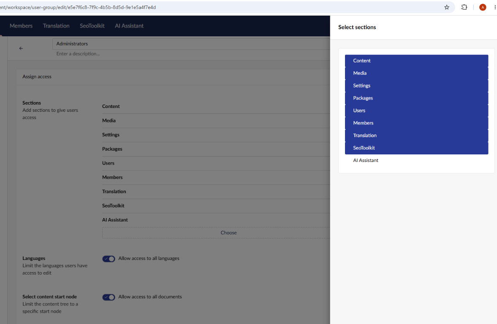
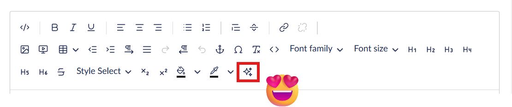
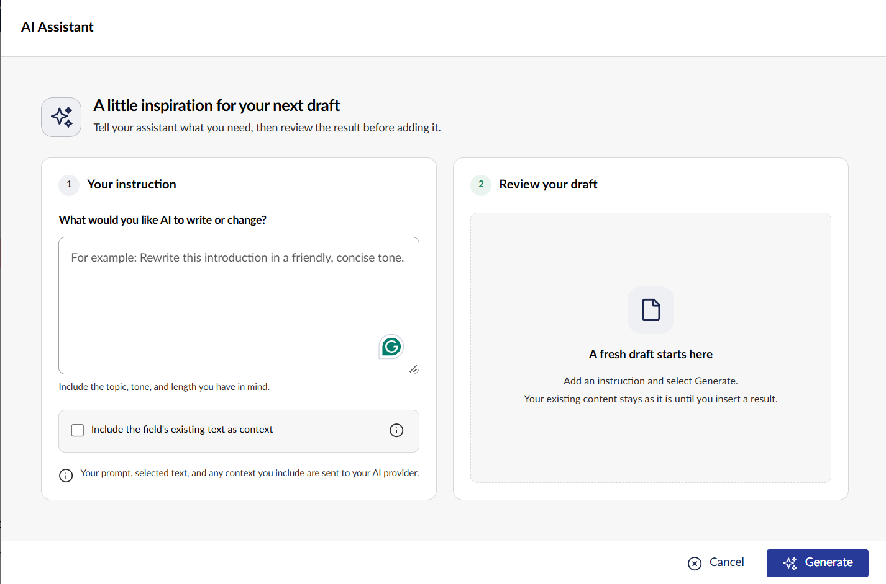

# Editor Assistant AI for Umbraco

Editor Assistant AI helps editors write and improve content in the Umbraco Rich Text Editor and gives website visitors concise page summaries through a floating **Summarize page** button. Both features share one AI provider connection, configured from the Umbraco backoffice.

## What it does

- Adds an **AI Assistant** section to the Umbraco backoffice.
- Provides a responsive setup page with provider settings, a page summaries switch, and feature setup guidance.
- Supports Microsoft Azure OpenAI, OpenAI, Anthropic Claude, Google Gemini, DeepSeek, and local Ollama.
- Tests the provider connection before saving settings.
- Caches identical page summaries in memory for one day. Editor generation and connection tests always call the provider directly.
- Stores provider settings using ASP.NET Core Data Protection encryption.
- Loads the frontend assistant through a script tag you add to your website layout.
- Shows the assistant only on public frontend pages, never inside `/umbraco`.
- Renders summaries in a friendly floating dialog with readable point-by-point cards.
- Adds an **AI Assistant** action to the backoffice TipTap rich text toolbar for generating, inserting, and improving selected text.

## Requirements

- Umbraco CMS 17.7.0 (the version referenced by this project).
- .NET 10 SDK and runtime.
- For frontend development and tests: Node.js 20.19+ in the 20.x line, 22.12+ in the 22.x line, or 24+. These ranges satisfy the current Vite and Vitest requirements.
- Either a cloud AI provider account with an API key and model/deployment, or a local Ollama installation with a downloaded model.
- Cloud providers require an API key and may incur usage charges. Ollama runs locally, does not require an API key, and does not send page content to a cloud provider.

## Installation

Install the NuGet package in the Umbraco web project:

```bash
dotnet add package EditorAssistant.AI.Umbraco
```

Alternatively, add the package reference to the web project's `.csproj`:

```xml
<PackageReference Include="EditorAssistant.AI.Umbraco" Version="1.2.0" />
```

Restore and start the Umbraco website:

```bash
dotnet restore
dotnet run
```

The package registers its Umbraco API automatically. Add the frontend JavaScript to your website layout manually as described below.

### Add the frontend script to your layout

Open the shared Razor layout used by your public pages, for example `Views/Master.cshtml` or `Views/Shared/_Layout.cshtml`. Add this script tag immediately before the closing `</body>` tag:

```cshtml
    <script type="module" src="@Url.Content("~/App_Plugins/EditorAssistantAIUmbraco/editor-assistant-frontend.js")"></script>
</body>
```

Keep `type="module"` because this is a JavaScript module entry point. The package supplies the JavaScript files; you do not need to copy them into your project. `Url.Content` resolves the URL relative to your application's root.

Include the script once in each layout where you want the assistant to appear. Pages that use a different layout need the same script tag in that layout. Then configure the provider and turn on **Enable page summaries** in the backoffice using the steps below.

On public frontend pages, visitors can use the floating **Summarize page** button:



## Configure the assistant

### Find the setup page

1. Sign in to the Umbraco backoffice at `/umbraco`.
2. Open the **AI Assistant** section in the left-hand backoffice navigation.
3. Open the **Setup** view.
4. Under **Connect your AI provider**, select a provider and enter its model or deployment, endpoint where required, and API key. Leave the API key blank to keep the saved key; Ollama does not require one.
5. In the **Page summaries** card, turn on **Enable page summaries** if you want public page summaries. This switch does not affect the Rich Text Editor assistant. Select **Test connection** to check the connection, then **Verify & save** in provider settings to persist all settings. Saving settings also verifies the connection.
6. Follow **Make it yours** to set up the features you want: add **AI Assistant** to a Rich Text Editor data type's toolbar, include the frontend script in your public layout, or do both.

### Setup page layout

The refreshed setup page puts **Connect your AI provider** first, with connection settings and actions in one card. **Make it yours** groups the editor and visitor setup instructions alongside it on wide screens; the sections stack on narrower screens.

The **Enable page summaries** switch is in the Page summaries card and controls only public website summaries. Select **Verify & save** to persist changes. Success and error messages appear below the connection actions, and **Frontend script for page summaries** expands to show the Razor script tag.

The privacy note below the setup sections explains what content each feature sends to the configured provider.

The version 1.2.0 setup page brings provider settings, feature guidance, and the page summaries switch together:



The assistant button is not displayed inside `/umbraco`. It appears on public frontend pages that include the script after the feature is enabled and the provider has been configured successfully.

Identical page-summary requests are cached in memory for one day, keyed by provider, model, endpoint, API key, and prompt. The cache is local to the Umbraco application instance and clears when the application restarts. Connection tests and Rich Text Editor generation bypass the cache.

### Backoffice permissions

The AI Assistant section is permission-protected. A user must belong to a user group that has access to the section:

1. Sign in as an administrator or another user with permission to manage users.
2. Open **Users** in the Umbraco backoffice.
3. Open **User groups**.
4. Select the user group for the editor.
5. Grant access to the **AI Assistant** section.
6. Save the user group, sign out and back in (or reload the backoffice), and check the left-hand navigation again.

When selecting sections for a user group, choose **AI Assistant** as shown below:



If the tab is still missing, confirm that the logged-in user belongs to the edited user group and perform a hard refresh to clear cached backoffice assets.

### Provider requirements

The setup page supports six providers. The provider name, model name, endpoint, and API key must match the selected provider.

| Provider | What you need | Endpoint | API key |
| --- | --- | --- | --- |
| Microsoft Azure OpenAI | An Azure OpenAI resource and a deployed model | Your Azure OpenAI resource endpoint, for example `https://your-resource.openai.azure.com` | An Azure OpenAI key |
| OpenAI | An OpenAI project/API key and an available model | Not required | An OpenAI API key with available quota |
| Anthropic Claude | An Anthropic API key and an available Claude model | Not required | An Anthropic API key |
| Google Gemini | A Google AI Studio/Gemini API key and an available Gemini model | Not required | A Gemini API key with access to the selected model |
| DeepSeek | A DeepSeek API key and an available DeepSeek model | Not required | A DeepSeek API key with available quota |
| Ollama | Ollama installed on the Umbraco server and a downloaded local model | Normally `http://localhost:11434` | Not required |

### Model and deployment values

Enter the exact value expected by the provider:

- **Azure OpenAI:** enter the deployment name you created in Azure, not just the underlying model family.
- **OpenAI:** enter an available model such as `gpt-4o-mini`.
- **Claude:** enter the exact Claude model identifier available to your Anthropic account.
- **Gemini:** enter the exact Gemini model identifier supported by the Gemini `generateContent` API, such as `gemini-flash-latest`.
- **DeepSeek:** enter the exact model identifier available to your account, such as `deepseek-chat`.
- **Ollama:** enter the local model name, such as `llama3.2`.

Use the model documentation link beside **Model / deployment** in the setup page to check the current provider model names. Provider model availability can change over time.

### Provider-specific setup

#### Microsoft Azure OpenAI

Create an Azure OpenAI resource, deploy a model, and copy:

- The resource endpoint into **Azure OpenAI endpoint**.
- The deployment name into **Model / deployment**.
- One of the resource API keys into **API key**.

#### Google Gemini

Create a Gemini API key in Google AI Studio, ensure the selected model is available to the key, and enter the key and model in the setup page. The package sends Gemini requests using the native `generateContent` API.

#### Ollama

The Ollama provider uses [OllamaSharp](https://github.com/awaescher/OllamaSharp) through the Microsoft.Extensions.AI chat interface.

Install Ollama on the same machine that runs Umbraco, start the service, and download a model:

```bash
ollama serve
ollama pull llama3.2
```

Use `llama3.2` as the model and `http://localhost:11434` as the endpoint. Ollama is local and does not require an API key.

## AI Assistant in the Rich Text Editor

The package includes a toolbar extension for Umbraco 17's `Umb.PropertyEditorUi.Tiptap` editor and `Umbraco.RichText` properties. No Umbraco core changes or frontend layout script are needed for this backoffice feature.

The **AI Assistant** toolbar button uses a sparkle icon. Select it to open the instruction and draft preview popup. Its position depends on how you configure the data type's toolbar.



1. Configure an AI provider in **AI Assistant > Setup**. The page summaries switch does not need to be enabled to use the editor assistant.
2. Open **Settings > Data Types** and select the Rich Text Editor data type used by your property.
3. In its toolbar configuration, add **AI Assistant** to the desired toolbar row and save the data type. Repeat for other rich text data types where needed.
4. Open a content item using that property. Optionally select text, then click the **AI Assistant** toolbar button.
5. In **Your instruction**, enter a request, such as "Improve the selected text and make it more professional", and select **Generate**. Optionally check **Include the field's existing text as context** to send the entire field's plain text alongside your instruction.
6. Review the generated preview. Choose **Insert** at the captured cursor position, **Replace selected text**, or **Insert after selected text**. **Regenerate** requests a new result; **Cancel** leaves the field untouched.
7. Save or publish the content normally. Insertion uses TipTap commands and participates in the editor's change tracking and undo history.

Formatting must be supported by the data type's enabled TipTap extensions. The assistant accepts paragraphs, headings (h2-h6), lists, bold, italic, blockquotes, line breaks, and links. Unsupported output shows an error so you can regenerate it. Previewed HTML is constrained and shown in a sandboxed frame. If the rich text changes while the dialog is open, cancel and reopen the assistant to capture a fresh selection.

### Popup layout and context hint



The popup separates **Your instruction** and **Review your draft** into two panels on wide screens and stacks them on smaller screens. The preview panel shows an empty state before generation, a loading message while the provider responds, and the generated draft when it is ready. Selected text can be expanded in the instruction panel.

The context checkbox is off by default. It sends only the current Rich Text Editor field's existing text, rather than the whole content item, to help the AI match the topic and tone. Hover over the info icon beside the checkbox, or focus it with the keyboard, to see the explanation. Press **Escape** to dismiss the tooltip. Including context does not automatically change the field.

**Generate** creates the first draft; **Regenerate** requests another result. Insertion options appear after a draft is generated. **Cancel** stays available during generation and cancels the browser request.

### Connect a different AI implementation

The feature already uses the package's configured provider; it does not return mock content. The client abstraction is `AiService.executePrompt` in `src/EditorAssistant.AI.Umbraco/Client/src/rte/ai/ai.service.ts`. Its request contains `prompt`, `selectedText`, and optional `context`.

The default implementation calls `POST /umbraco/editorassistantaiumbraco/api/v1/ExecutePrompt` with the backoffice bearer token. The server integration point is `AIAssistantController.ExecutePrompt`, which calls the existing `IChatClientFactory.GetResponseAsync`. Comments mark both integration points. Keep provider credentials and provider calls on the server when substituting your own implementation.

This endpoint requires authenticated backoffice access to the Content section. Requests time out after 90 seconds; cancelling the dialog cancels the browser request. Generate and insertion actions are disabled while a request is running.

The toolbar uses `tiptapToolbarExtension` with `kind: 'button'` and `UmbTiptapToolbarElementApiBase.execute(editor)`, plus an Umbraco modal token and modal manifest. It uses the existing editor schema and does not require a separate TipTap node or mark extension. The client depends on `@umbraco-cms/backoffice` **^17.7.0**. See the [Umbraco 17 toolbar API](https://apidocs.umbraco.com/v17/ui-api/classes/packages_tiptap.UmbTiptapToolbarElementApiBase.html).

Run the rich text command tests from the client directory with `npm test`, and build the packaged assets with `npm run build`.

## Security and privacy

- Cloud provider API keys are encrypted with ASP.NET Core Data Protection.
- API keys are never returned to the browser by the settings endpoint.
- Encrypted settings are stored in `App_Data/EditorAssistant.AI/settings.json` under the website content root. Preserve the settings file and the application's Data Protection keys when moving an existing configuration to another environment.
- The public summarize endpoint sends the page text to the configured provider when a visitor requests a summary.
- The backoffice rich text assistant sends the editor's prompt, selected text, and optional field context to the configured provider when **Generate** or **Regenerate** is selected.
- The **Enable page summaries** switch controls the public summary button and summarize endpoint. It does not disable the authenticated Rich Text Editor assistant.

## Building from source

Build the .NET solution:

```bash
dotnet build EditorAssistant.AI.Umbraco.slnx
dotnet test EditorAssistant.AI.Umbraco.slnx
```

Build the client bundle:

```bash
cd src/EditorAssistant.AI.Umbraco/Client
npm ci
npm run build
npm test
```

The client build writes the packaged assets into `src/EditorAssistant.AI.Umbraco/wwwroot/App_Plugins/EditorAssistantAIUmbraco`.

## Project structure

```text
src/
  EditorAssistant.AI.Umbraco/       Package source and backoffice client
tests/
  EditorAssistant.AI.Umbraco.Tests/ Unit tests
docs/
  images/                           Documentation images
```

## Troubleshooting

- **AI Assistant is not visible:** grant the user group access to the section and reload the backoffice.
- **The rich text AI button is missing:** add **AI Assistant** to the toolbar in the property's Rich Text Editor data type configuration, save, and reload the content editor.
- **The public Summarize page button is not visible:** confirm the page's layout includes the frontend script tag above and that the script loads successfully in the browser. Turn on **Enable page summaries** in the Page summaries card, select **Verify & save**, and reload the public page. For cloud providers, an API key must be configured.
- **The context tooltip is not visible:** hover over the info icon beside the context checkbox, or reach it using Tab. The explanation is hidden until the icon is hovered or focused.
- **Model unavailable:** check the provider's current model list and enter the exact model or deployment name.
- **Ollama cannot connect:** confirm `ollama serve` is running, the endpoint is reachable from the Umbraco server, and the model has been pulled.
- **Stale frontend assets:** rebuild the client and hard-refresh the browser.

## License

Licensed under the [MIT License](LICENSE).
